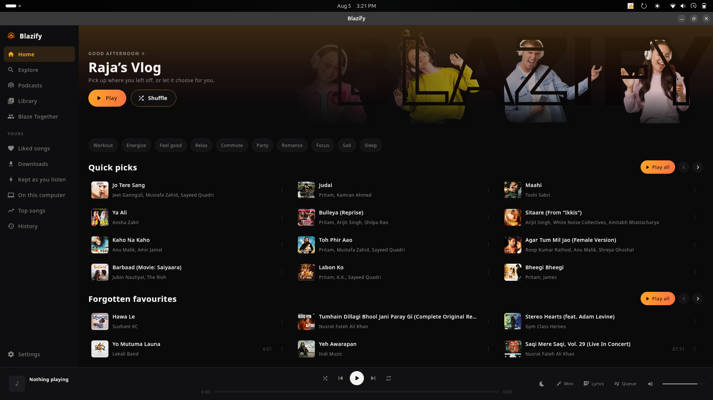
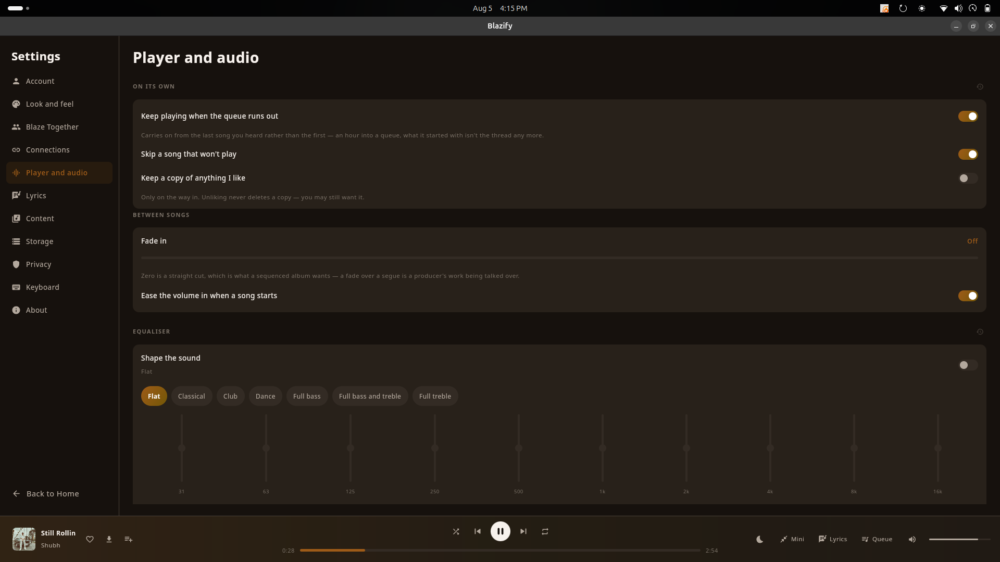
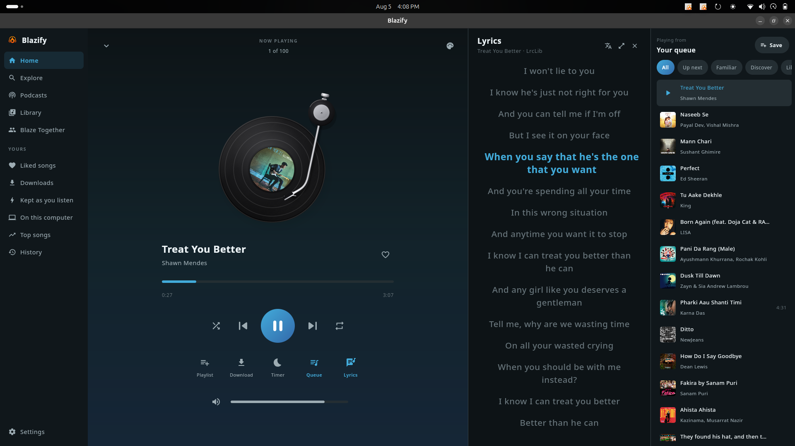
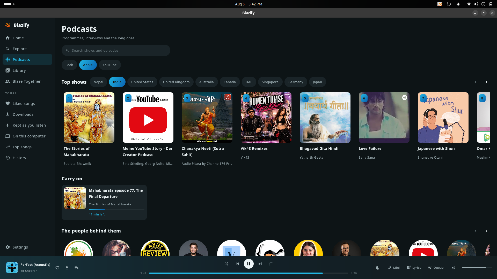
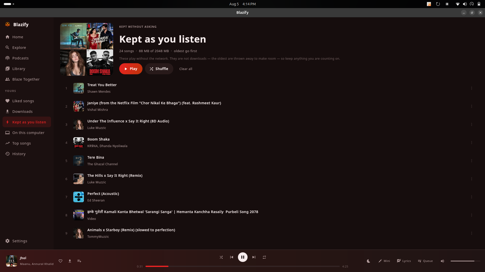
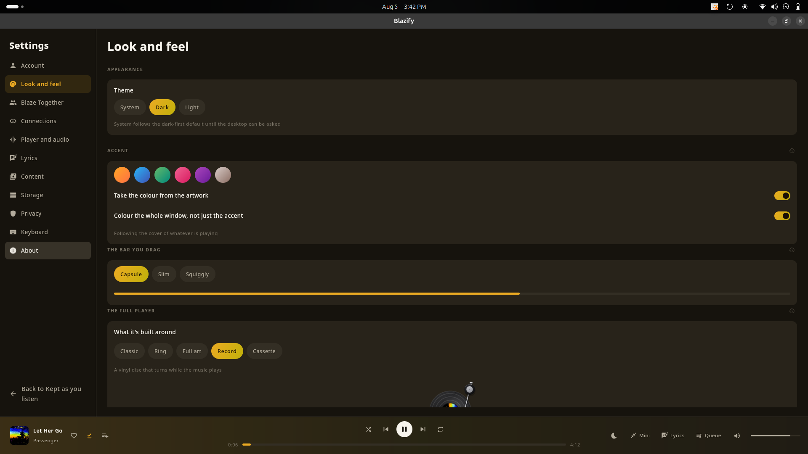
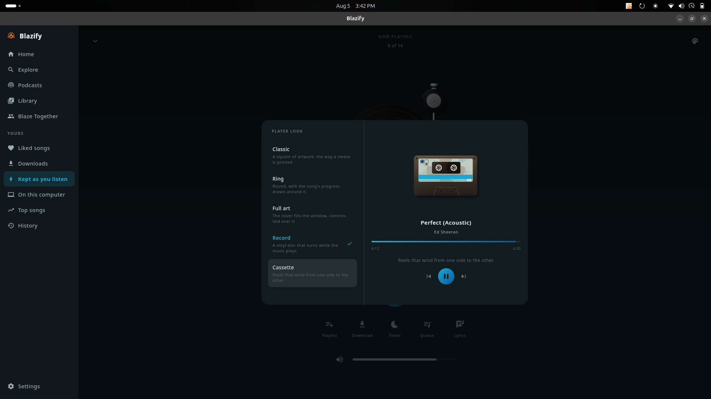

<div align="center">


# Blazify

**A music player for Linux and Windows.**

Search a catalogue of millions of songs or point it at the music already on your
machine, keep what you want for when the network isn't there, follow the words
as they're sung, and listen to programmes as well as records.

</div>



---

## Blazify everywhere else

The same player, built natively for each place you use it.

| Platform | Download | Source |
|---|---|---|
| **Android** phones and tablets | [Blazify.apk](https://github.com/rajendra7169/blazify/releases/latest/download/Blazify.apk) | [rajendra7169/blazify](https://github.com/rajendra7169/blazify) |
| **Windows** installer | [Blazify-setup.exe](https://github.com/rajendra7169/blazify-desktop/releases/latest/download/Blazify-setup.exe) | [rajendra7169/blazify-desktop](https://github.com/rajendra7169/blazify-desktop) **← you are here** |
| **Linux** | [deb, AppImage, tar.gz](https://github.com/rajendra7169/blazify-desktop/releases/latest) | [rajendra7169/blazify-desktop](https://github.com/rajendra7169/blazify-desktop) **← you are here** |
| **iPhone** sideloaded | [Blazify.ipa](https://github.com/rajendra7169/blazify-ios/releases/latest/download/Blazify.ipa) | [rajendra7169/blazify-ios](https://github.com/rajendra7169/blazify-ios) |

Screenshots, install guides and everything else: **[blazify website](https://rajendra7169.github.io/blazify/)**

---

## What it does

### Listening

- **Millions of songs**, searched by name or found by browsing — songs, videos,
  albums, artists, playlists, podcasts and episodes, each asked for properly
  rather than filtered out of one list.
- **Your own files** alongside them. Point it at a folder and everything in it
  turns up, tags, covers and all.
- **A queue that holds anything** — a song, then an episode, then a song again.
  Reorder it by dragging, save it as a playlist, or look through it filtered by
  what's already played.
- **Radio from any song**, when you want it to keep going by itself.
- **Sleep timer**, with an end-of-track option so it never cuts off mid-song.
- **Ten-band equaliser**, with presets and a flat reset.
- **Speed control for talk** — an hour at 1.5× is the same hour with twenty
  minutes handed back. Songs are left alone: speeding one up changes its key.
- **Volume levelling**, off by default, for queues that mix a record mastered in
  1975 with one mastered last year.
- **Media keys and the system panel.** Play, pause, next and previous from the
  keyboard; title, artist and cover in your desktop's own media widget.



### Words



- **Lyrics from five sources**, asked in an order you set, because no one
  service has everything — one is excellent for Western pop and thin on
  everything else, another is the reverse.
- **Timed, and following along**, with a full-screen view for a sheet propped
  across a room.
- **Translation and romanisation**, for singing along to a script you can't read.
- **Transcripts for programmes**, where the makers published them.

### Programmes



- **Two directories at once.** The open podcast directory knows the world's
  programmes — Test Match Special with 657 episodes, The Daily with 2,680 — and
  the music catalogue knows the local ones whose makers never registered a feed.
  Measured both ways; neither is a superset of the other, so both are asked and
  the same show found twice is listed once.
- **Real charts, by country**, without an account — Nepal, India, and eight more.
- **Follow a show** and its newest episode appears on the page.
- **Chapters**, where a show publishes them: the part you're inside is marked,
  and pressing any of them jumps there.
- **Episode notes**, because deciding to give up an hour on the strength of a
  headline is how a queue fills with things nobody plays.
- **Sorted by how long a programme has been going**, when a subject brings back
  a hundred shows and four of them matter.

### Keeping things

- **Downloads** — a promise that a song will be there.
- **Kept as you listen** — songs held quietly as you play them, with their covers
  and words, thrown away oldest-first when there's no room. Downloading is a
  decision made in advance, and the trouble with those is that nobody makes them:
  the moment you need a song offline is the moment you can't fetch it.
- **Resume for anything long.** A ten-minute-plus recording remembers where you
  were, and a *Pick up where you left off* row puts it back in front of you.
  Music and talk are kept apart — an episode belongs on the podcasts page.



### Together

- **Blaze Together** — a room where everyone hears the same song at the same
  moment. The wire carries which song and where in it, never the audio.
- **Last.fm scrobbling** and **Discord presence**, both optional, both with your
  own credentials.
- **Recognition** — ten seconds through the microphone to name what's playing in
  the room, then play it here.

### Look



- **Five players to choose between**: a printed sleeve, a ring, full-bleed art, a
  turning record, a winding cassette.



- **Colour taken from the artwork**, accent only or the whole window — the
  screenshots on this page are the same application on the same evening.
- **Dark, light, or whatever the desktop is doing.**
- **A mini player** that stays on top, and a tray icon with the transport on it.

---

## Installing

### Linux

Three shapes, on the [releases page](../../releases/latest):

| | |
|---|---|
| **`.deb`** | Debian, Ubuntu, Mint, Pop!_OS |
| **`.AppImage`** | Fedora, Arch, openSUSE, or anywhere. One file, nothing installed |
| **`.tar.gz`** | The same application as a plain folder |

```bash
sudo apt install ./blazify_1.0.5_amd64.deb
```

It lands in the applications menu under Sound & Video. The package brings its own
Java runtime, so nothing else is needed — except the audio library, which `apt`
pulls in:

```
libvlc5, vlc-plugin-base
```

That dependency is deliberate rather than an oversight: the catalogue serves
fragmented MP4, and the lighter media libraries refuse to open it at all.

`libsecret-tools` is recommended but not required — it's one of two ways to read
a browser session, and there's a third that needs nothing at all.

> Use `apt` rather than `dpkg -i`. Both install the package; only one resolves
> what it depends on.

The AppImage asks for nothing at all — the audio library and its decoders travel
inside it, so it plays on a machine that has never heard of VLC:

```bash
chmod +x Blazify-1.0.5-x86_64.AppImage
./Blazify-1.0.5-x86_64.AppImage
```

### Windows

Run the installer. It offers a folder, adds a Start menu entry and a desktop
shortcut, and needs no administrator password. Installing a newer version
upgrades the old one rather than sitting beside it.

Nothing else is needed — the audio library travels inside the package.

---

## Signing in

Signing in is optional. Signed out you get the catalogue, your own files, your
own playlists and everything you keep; signed in you also get your playlists,
your history and a feed built from what you actually listen to.

**Settings → Account → Sign in** opens a browser window on Google's own page,
using a profile that belongs to Blazify and nothing else. You sign in there and
it closes itself. No password passes through this application.

<details>
<summary>Why a window of its own rather than reading the browser you use</summary>

Because a browser you're using doesn't hold still. The site rotates the session
every few minutes and keeps the new values in memory, so what's on disk is
always the superseded copy — measured, and it fails the same way every time. A
profile nothing else opens holds still, and the session written when the window
closes is still current when it's read a second later.

Reading a browser you've already quit is still offered underneath, because when
it works it's one press and no window at all.
</details>

---

## Keyboard

| | |
|---|---|
| <kbd>Space</kbd> · <kbd>K</kbd> | Play or pause |
| <kbd>←</kbd> <kbd>→</kbd> · <kbd>J</kbd> <kbd>L</kbd> | Back and forward five seconds |
| <kbd>P</kbd> · <kbd>N</kbd> | Previous and next track |
| <kbd>↑</kbd> <kbd>↓</kbd> | Volume |
| <kbd>M</kbd> | Mute |
| Media keys | Play, pause, next, previous |

The letter shortcuts stand down while you're typing. The media keys never do.

---

## Where things are kept

Liked songs, history, saved albums, playlists, downloads, cached songs, resume
positions and settings live in the folder each platform sets aside:

| | |
|---|---|
| Linux | `~/.local/share/blazify` |
| Windows | `%APPDATA%\Blazify` |

Plain JSON, one file per thing, safe to read and safe to delete. **Settings →
Storage** says how much room each part is using and clears any of it.

Nothing is sent anywhere except to the services you switch on. Keys and tokens
are yours: none are baked into the build, because one shipped inside an open
repository is one anybody can lift.

---

## Building

Needs JDK 21. Everything else the wrapper fetches.

```bash
./gradlew :app:run                  # run it from source
./gradlew :app:createDistributable  # a self-contained folder you can run
./gradlew :app:packageDeb           # .deb   (build on Linux)
./gradlew :app:packageExe           # .exe   (build on Windows)
./gradlew :app:packageMsi           # .msi   (build on Windows)
```

Each installer carries its own Java runtime, so it is built on the platform it
targets — there is no cross-building. Pushing a tag builds both and collects
them on one release page:

```bash
git tag v1.0.2 && git push --tags
```

The first Windows package also fetches the audio library once (about 78 MB) and
keeps the part a music player uses. Linux declares a dependency instead, so a
shared copy is used and nothing is bundled.

### Layout

| Module | What it holds |
|---|---|
| `app` | The application: window, screens, playback |
| `innertube` | The catalogue client — search, browse, streams |

### Probes

Ways to exercise one piece from a terminal, which is far quicker than clicking
through the window when something needs checking — and how most of the awkward
questions in this project were actually settled.

```bash
./gradlew :app:probe          --args="let her go"    # search and resolve a stream
./gradlew :app:soundProbe     --args="--app --time 20 kesariya"
./gradlew :app:lyricsProbe    --args="Kesariya 'Arijit Singh' 269"
./gradlew :app:localScanProbe --args="$HOME/Music"   # scan a folder and play a find
./gradlew :app:sessionProbe                          # which browsers hold a session
./gradlew :app:mixedProbe                            # podcasts, both directories
./gradlew :app:captionProbe                          # transcripts and chapters
./gradlew :app:chartProbe                            # what the charts return
./gradlew :app:resumeCheck                           # the rules for remembering
```

---

## Support

Blazify is free, has no advertisements, and asks for nothing to work. If it has
earned you a few evenings and you would like to say so, there is a coffee:

<div align="center">


*Scan to support Blazify*

</div>

Not expected and never asked for inside the application — it sits on the About
page beside the name, where somebody who has been using a thing for months can
find it if they go looking.

---

## Licence

GPL-3.0. See [`LICENSE`](LICENSE).

Built on the shoulders of the open-source work that makes a player like this
possible: [libVLC](https://www.videolan.org/vlc/libvlc.html) through
[vlcj](https://github.com/caprica/vlcj) for playback,
[Compose Multiplatform](https://www.jetbrains.com/lp/compose-multiplatform/) for
the window, [Ktor](https://ktor.io) for the network,
[LRCLIB](https://lrclib.net) and [KuGou](https://www.kugou.com) among the lyric
sources, and the open podcast directory every podcast application reads.

<div align="center">

Made with ❤️ by **Rajendra Pandey**

[Website](https://www.rajendrapandey.info.np/) · [GitHub](https://github.com/rajendra7169) · [Instagram](https://www.instagram.com/raja.indra7169)

</div>
